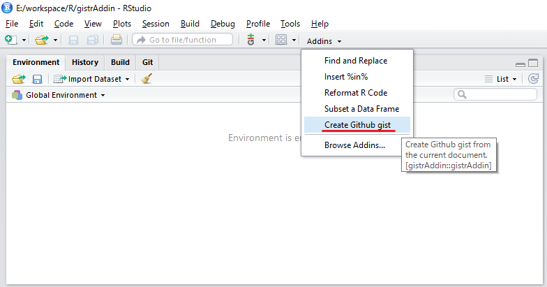
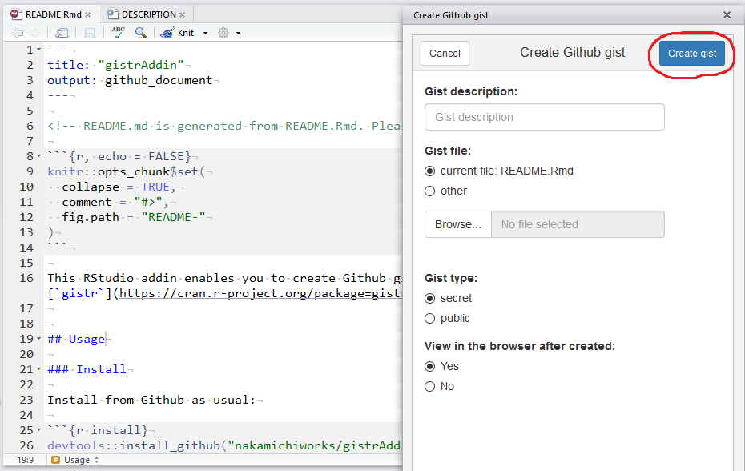

gistrAddin
================

<!-- README.md is generated from README.Rmd. Please edit that file -->
This RStudio addin enables you to create Github gists easily in RStusio with [`gistr`](https://cran.r-project.org/package=gistr) package.

Usage
-----

### Install

Install from Github as usual:

``` r
devtools::install_github("nakamichiworks/gistrAddin")
```

The package is automatically registered as RStudio addin. See [RStudio Addins](https://rstudio.github.io/rstudioaddins/) for explanation.

### Authentication

You need to authorize [`gistr`](https://cran.r-project.org/package=gistr) with your Github account first. Please refer to `gistr` package's [README](https://github.com/ropensci/gistr#authentication) for detailed instruction.

### Create gists

-   Select "Create Github gist" from RStudio addins menu. 

-   Select gist files, set options, and push "Create gist" button. 

-   URL for the created gist is returned (and opened in your borwser if needed). 
